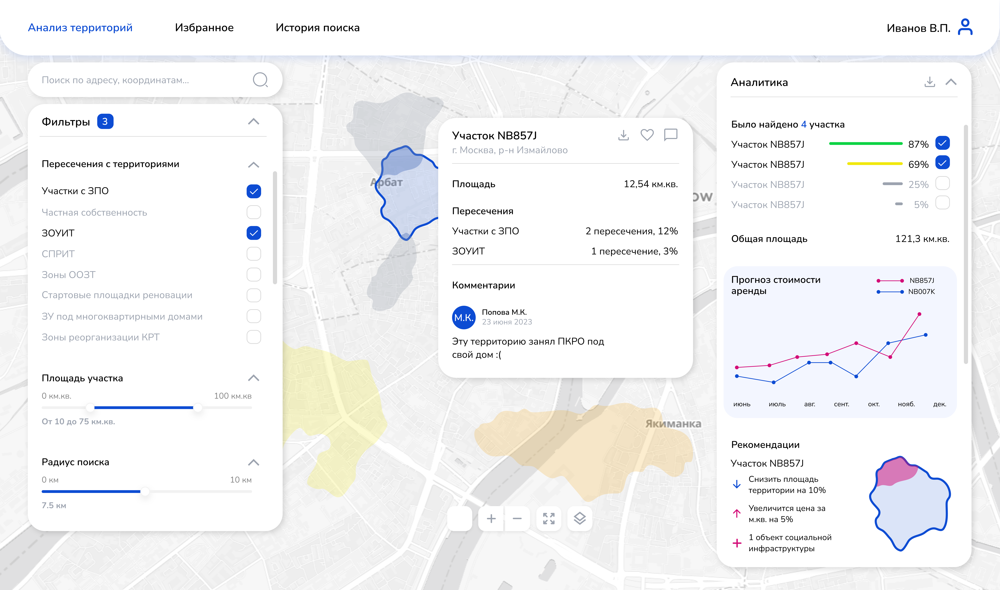
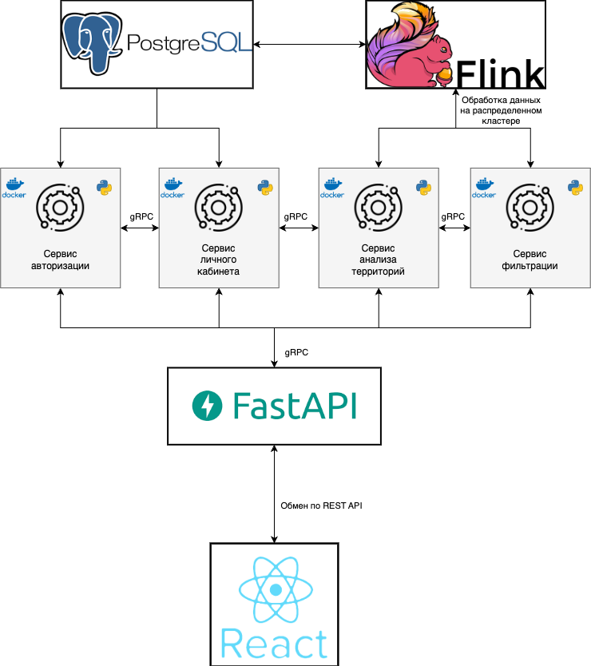

## LCT 2024 4 трек dorateam
Репозиторий проекта хакатона ЛЦТ 2024 трек 4 от команды dorateam.

### Рабочий прототип

### Прототип в Figma
[Ссылка](https://www.figma.com/design/tcq0tgLDgDZQucCx6NIdj4/%D0%BB%D1%86%D1%8224?node-id=0-1&t=81d1cDCnlHG6WQxI-1)

### Презентация
WIP

### Поставленная проблема
- Подбор и анализ земельных участков в Москве ведется вручную, что требует много времени и усилий.
- Частые изменения в градостроительных данных и ограничениях делают ранее подобранные участки быстро устаревшими.
- Разнородные данные из разных источников усложняют анализ и принятие решений.
- Существует необходимость в автоматизации процесса для повышения эффективности и создания цифрового земельного баланса.
- Требуется удобный интерфейс для пользователей и поддержка различных баз данных и технологий.

### Архитектура решения

Наша архитектура позволяет легко интегрироваться в существующую экосистему. 
Также в будущем в нее можно интегрировать новые сервисы.  
В качестве базы данных используется база данных PostgreSQL.  
Обработка данных происходит на кластере `Apache Flink`.
Кроме того, использование `Apache Flink` обеспечивает масштабируемость и отказоустойчивость.

### Авторство
dorateam, 2024